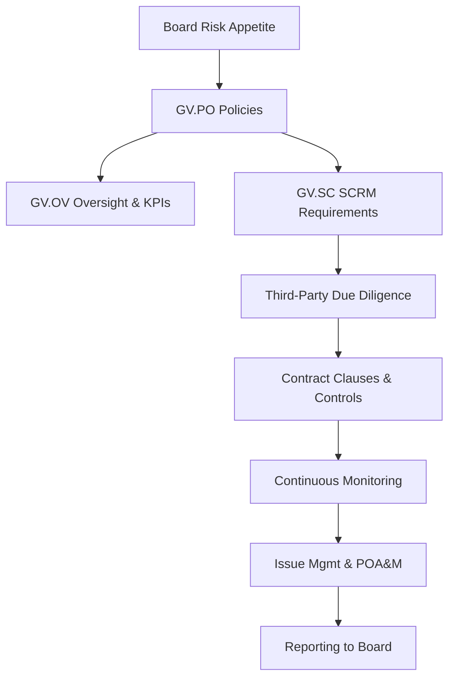

<!--
Title: Diagram – Governance & SCRM Flow
Author: Bozhidar Nikolchev  
Program: 30-Day Compliance – Day 8 (NIST CSF)
Date: 2026-03-03
-->

```mermaid
flowchart TB
  A[Board Risk Appetite] --> B[GV.PO Policies]
  B --> C[GV.OV Oversight & KPIs]
  B --> D[GV.SC SCRM Requirements]
  D --> E[Third-Party Due Diligence]
  E --> F[Contract Clauses & Controls]
  F --> G[Continuous Monitoring]
  G --> H[Issue Mgmt & POA&M]
  H --> I[Reporting to Board]
```
