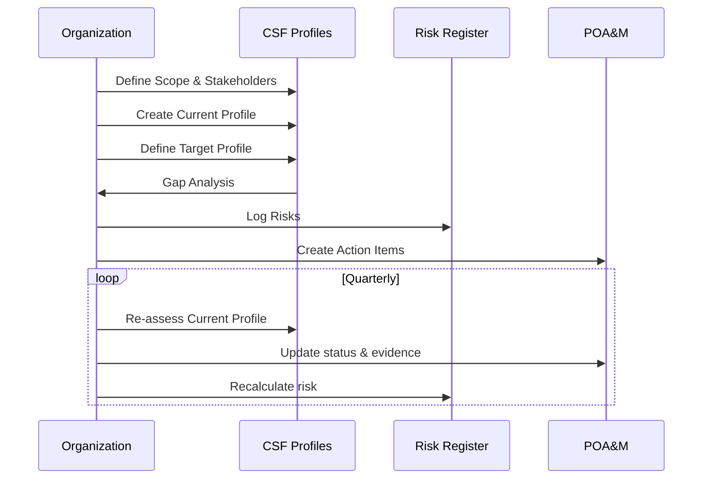

<!--
Title: Diagram – Profile Workflow
Author: Bozhidar Nikolchev  
Program: 30-Day Compliance – Day 8 (NIST CSF)
Date: 2026-03-03
-->

```mermaid
sequenceDiagram
  participant Org as Organization
  participant CSF as CSF Profiles
  participant Risk as Risk Register
  participant Plan as POA&M

  Org->>CSF: Define Scope & Stakeholders
  Org->>CSF: Create Current Profile
  Org->>CSF: Define Target Profile
  CSF->>Org: Gap Analysis
  Org->>Risk: Log Risks
  Org->>Plan: Create Action Items
  loop Quarterly
    Org->>CSF: Re-assess Current Profile
    Org->>Plan: Update status & evidence
    Org->>Risk: Recalculate risk
  end
```
